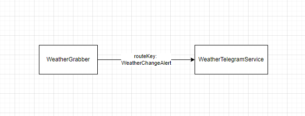
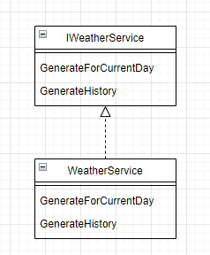
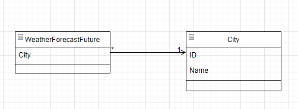
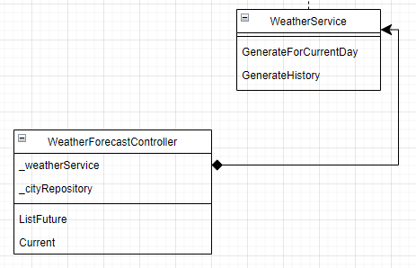
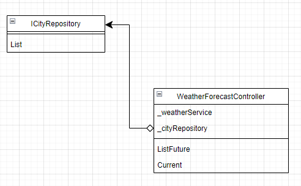

# Лабораторная №2
## Отношения между классами

#### Наследование:
```csharp
public class WeatherHistory
{
    public DateOnly Date { get; set; }
    public int MinTemperature { get; set; }
    public int MaxTemperature { get; set; }
}
public class WeatherForecastFuture : WeatherHistory
{
    public City City { get; set; }
}
```


#### Реализация:
```csharp
public interface IWeatherService
{
    IEnumerable<WeatherForecast> GenerateForCurrentDay(int toHours);
    IEnumerable<WeatherHistory> GenerateHistory(DateTime fromDate, DateTime toDate);
}
public class WeatherService : IWeatherService
{
    public IEnumerable<WeatherForecast> GenerateForCurrentDay(int toHours)
    {
        
    }

    public IEnumerable<WeatherHistory> GenerateHistory(DateTime fromDate, DateTime toDate)
    {
        
    }
}
```


#### Ассоциация:
```csharp
public class City
{
    public Guid ID { get; set; }
    public string Name { get; set; }
}
public class WeatherForecastFuture
{
    public City City { get; set; }
}
```


#### Композиция:
```csharp
public class WeatherForecastController
{
    private readonly IWeatherService _weatherService;
    public WeatherForecastController()
    {
        _weatherService = new WeatherService();
    }
}
```


#### Агрегация:
```csharp
public class WeatherForecastController
{
    private readonly ICityRepository _cityRepository;
    public WeatherForecastController(ICityRepository cityRepository)
    {
        _cityRepository = cityRepository;
    }
}
```



### Задание: 
Создать UML диаграмму отношений классов своего проекта. Реализовать каждый вид связи.

### Подробности:
https://metanit.com/sharp/patterns/1.2.php
